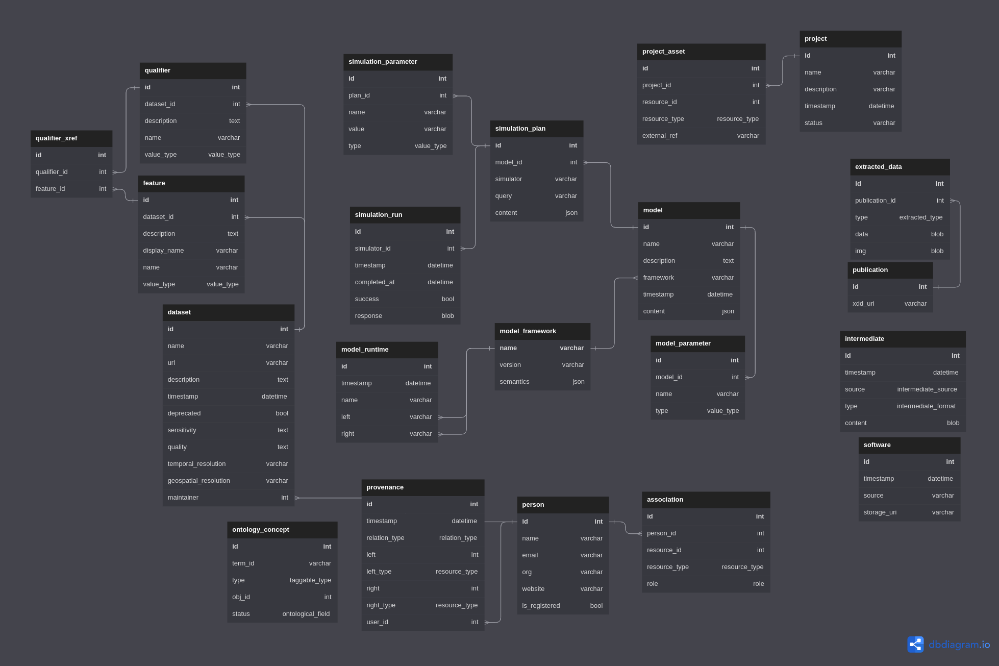

# ASKEM Data Service API

## Usage

The API can be started by simply calling the following commands with Python 3.10 as your python or python3 command
and poetry installed.

```
make init
make up
```

`make init` only needs to be called the first time the application is launched. Each subsequent time, `make up` starts the application.

Navigate to [http://localhost:8001/](http://localhost:8001/) to view the documentation for the endpoints

**EXPERIMENTAL**: Navigate to [http://localhost:8001/graphql](http://localhost:8001/graphql) to interactively use the GraphQL schema.

## Development

The requirements for developing this project locally are [Poetry](https://python-poetry.org/) and Docker.

Initialize the project using the following commands:
```
git clone git@github.com:DARPA-ASKEM/data-service.git
cd data-service
make init
```

To start the server in a docker container, run:
```
make up
```
which will also start a development instance of Postgres.

The server will not start if the generated model files are dirty i.e.
out of sync data model version or a non-autogenerated change to the
file contents. (Version is tracked using the DBML project `Note`).
The Jataware Python package [dbml-builder](https://pypi.org/project/dbml-builder/)
handles the code generation.

To generate new model files, run:
```
poetry run model-build generate ./askem.dbml ./tds/autogen
```

and check if they are valid by running

```
model-build check [current semantic version] ./src/autogen
```

Where [current semantic version] is the version of your dbml - ex. v0.11.3 . If the tables don't exist yet it in Postgres, make sure to POST to the `/admin/db/init` endpoint.

To access Postgres directly run:
```
docker compose exec -u postgres rdb psql -h localhost -U dev askem
```

### Testing

There are three types of tests:
1. `tests/service.py`: Tests REST and GraphQL representation of TERArium object. Affects MAJOR and MINOR SemVer.
1. `tests/search.py`: Uses sample queries to check multi-object search. Affects MAJOR and MINOR SemVer.
1. `tests/unittest.py`:  Tests under-the-hood functionality at the discrection of the developer. Affects PATCH SemVer.

### Populated Data

Sample data is automatically populated into the data service on `make up`
via `.sql` files and dataset files. These can be found in the `./data` directory.

In order to regenerate these files, run the following commands:
```
make down
make db-clean
make up
make populate
make db-full
```

## ASKEM Data Model



ERD was created using [DBML](https://www.dbml.org/home/) and rendered and edited using [dbdiagram](https://dbdiagram.io/)
