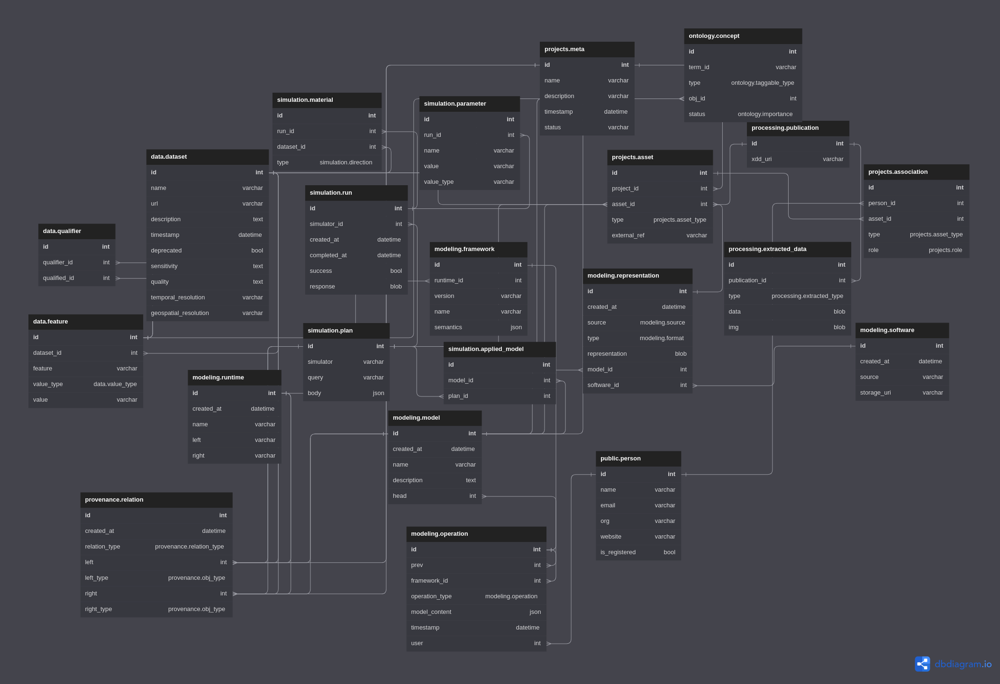

# ASKEM Data Store API

## ASKEM Data Model

ERD was created using [DBML](https://www.dbml.org/home/) and rendered and edited using [dbdiagram](https://dbdiagram.io/)

Graphic for the proposed data model:

